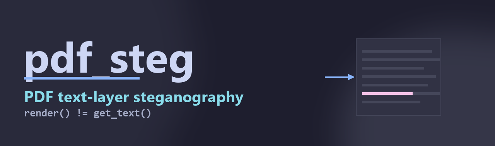
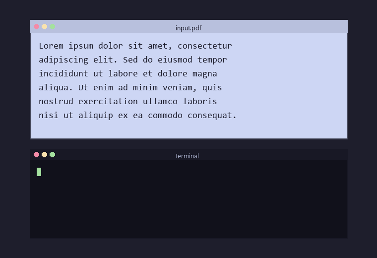

# pdf_steg

[Português](README.pt-BR.md) · English



> **PDF text-layer steganography toolkit.** Hide messages inside PDFs that
> render identically to the original to a human reader, but are extractable
> by software (`pdftotext`, `page.get_text()`, LLM document loaders…).
> Useful for watermarking, AI-agent ingestion-pipeline robustness testing,
> CTFs, and steganography research.



Built on [PyMuPDF](https://pymupdf.readthedocs.io/).

## What it does

A PDF has two layers that can disagree: what a human sees (rendered glyphs)
and what software extracts (the text layer / character objects). This tool
manipulates the disagreement.

Two techniques, two subcommands:

| Subcommand | Visible page                       | Text-layer content                        |
| ---------- | ---------------------------------- | ----------------------------------------- |
| `hide`     | Identical to original (rasterized) | Only the chosen letters of a secret message, at their original positions |
| `embed`    | Identical to original              | Original text + `[STG:<base64>:STG]` payload, rendered invisibly |

Both result in PDFs that look identical to the original to a human reader.
The difference is what `pdftotext` / `page.get_text()` / Ctrl+A returns.

## Why this exists

The capability is dual-use. Documented legitimate uses:

- **AI-agent security testing on systems you own** — verify whether a document
  ingestion pipeline (RAG, summarization, OCR) is influenced by content that
  isn't visible to a human reviewer. This is the same idea as prompt-injection
  research, applied to PDF inputs.
- **Watermarking** — embed an attribution / tracking string that survives
  copy-paste but doesn't pollute the visible layout.
- **Steganography research and CTFs** — illustrate text-layer / image-layer
  divergence cleanly.
- **Education** — show students how PDF text extraction differs from rendering.

Out of scope: targeting third-party systems without authorization, or evading
detection in adversarial deployments. Test on infrastructure you own or are
authorized to test.

## Install

```bash
pip install pymupdf
```

## Usage

### `analyze` — letter inventory

```bash
python pdf_steg.py analyze input.pdf
```

Prints how many of each character the PDF has. Use this to know whether your
secret message can be encoded by the `hide` technique (every letter of the
message must appear at least once in the document).

### `hide` — selective rasterization

```bash
python pdf_steg.py hide input.pdf -m "secret message" -o out.pdf [--mode MODE] [--seed N] [--dpi N] [--strict]
```

Renders every page as an image, then re-inserts an *invisible text layer*
(`render_mode=3`) containing only the chars of `--message`, each placed at
its original position in the source PDF. After the operation, copy-pasting the
whole PDF returns just the secret message; everything else is image, so it
isn't selectable.

By default the tool tries to embed **every** char of the message — letters,
digits, punctuation, and whitespace. If a non-alphanumeric char (e.g. `@`,
a space) can't be placed (no occurrence in the PDF, or no feasible ordering),
it's silently dropped from the embedded message and the omission is
reported on stderr. Alphanumerics are essential — losing one would corrupt
the message — so a missing letter is a hard error. Pass `--strict` to make
**any** missing char a hard error instead.

`--mode` controls how positions are picked from the available occurrences:

| Mode     | Behavior                                                           |
| -------- | ------------------------------------------------------------------ |
| `greedy` | First match after the cursor — chars cluster near the start        |
| `spread` | **Default.** Stratified random — each char targets its own slot of the document with jitter, falling forward into the next slot when the ideal one is empty |
| `even`   | Deterministic slot centers — evenly spaced, no randomness          |

If the message is feasible at all (each essential char has at least one
ordered occurrence), `spread` and `even` are guaranteed to insert it; they
never fail late. `--seed N` makes `spread` reproducible. `--dpi` controls
rasterization resolution (default 220).

### `reveal` — read a `hide`-produced PDF

```bash
python pdf_steg.py reveal out.pdf
```

Dumps the PDF text layer twice: as-extracted (with the line breaks that come
from chars being on different visual lines) and a "compact" variant with all
whitespace stripped, which is the message.

### `embed` — invisible-text payload

```bash
# default: keep visible text layer intact
python pdf_steg.py embed input.pdf -m "secret message" -o out.pdf

# also rasterize the visible text so the payload is the only extractable text
python pdf_steg.py embed input.pdf -m "secret message" -o out.pdf --rasterize [--dpi N]
```

Encodes the message as `[STG:<base64>:STG]` and adds it to the first page as
a 1-pt invisible text run. The page renders identically to the original.

| Flag             | Visible page         | What `get_text()` returns                          |
| ---------------- | -------------------- | --------------------------------------------------- |
| (none, default)  | Identical to source  | Source text + `[STG:...:STG]`                       |
| `--rasterize`    | Identical to source  | Only `[STG:...:STG]` (visible text becomes image)   |

The base64 layer means the message can include any UTF-8 (accents, emoji, …)
even if the embedded font lacks those glyphs.

### `extract` — read an `embed`-produced PDF

```bash
python pdf_steg.py extract out.pdf
```

Searches the page text for the `[STG:...:STG]` sentinel, base64-decodes the
payload, prints it.

## Limitations

- **Source PDF must have an extractable text layer.** Scanned PDFs without
  OCR have no text to work with — OCR them first.
- **`hide` requires every essential (alphanumeric) char of the message to
  exist in the source.** Accents are normalized (matching `á` to `a`).
  Non-alphanumeric chars (spaces, punctuation, symbols) are best-effort:
  the tool tries to embed them but drops them with a stderr warning if the
  PDF has no usable occurrence. Add `--strict` to fail loudly instead.
- **`embed` (default mode) leaves the visible text in the text layer.** Anyone
  doing Ctrl+A on the rendered PDF sees `[STG:...:STG]` somewhere in their
  clipboard. Use `--rasterize` for stronger covertness.
- **No cryptography.** The payload is base64, not encrypted. If you need
  confidentiality on top of obscurity, encrypt the message yourself before
  passing it in.

## Files

- [`pdf_steg.py`](pdf_steg.py) — the CLI
- [`make_sample.py`](make_sample.py) — generates a small test PDF
- `sample.pdf` / `big.pdf` — sample inputs (after running `make_sample.py`)

## License

[MIT](LICENSE) © 2026 Marcelo Duchene
